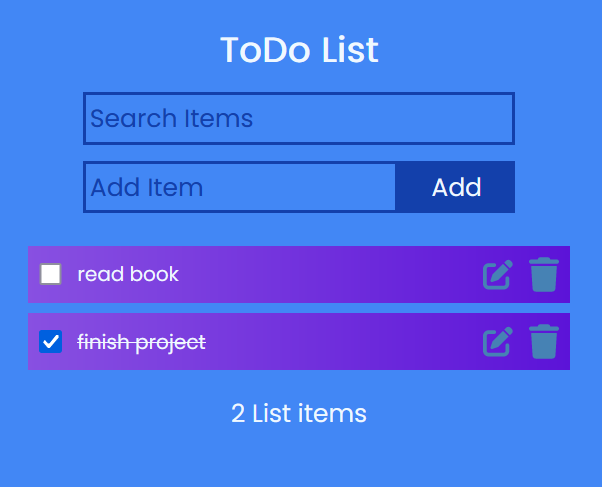
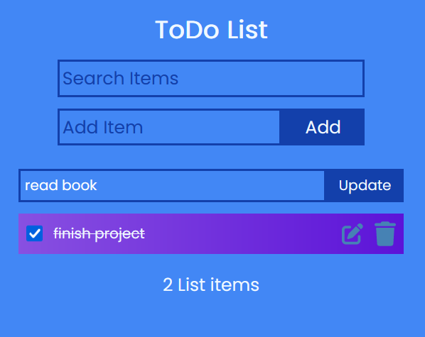
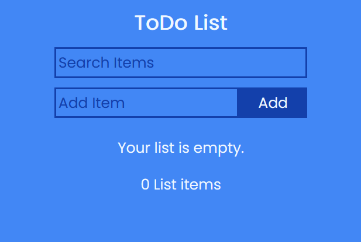

# ToDo List - React

ToDo list programmed in Javascript with framework React. WIth ToDo list user can do:

### Functions
 - create new task
 - mark as complete
 - edit task
 - remove task

## Screenshots

#### ToDo List

#### ToDo List - Edit

#### ToDo List - Empty list

